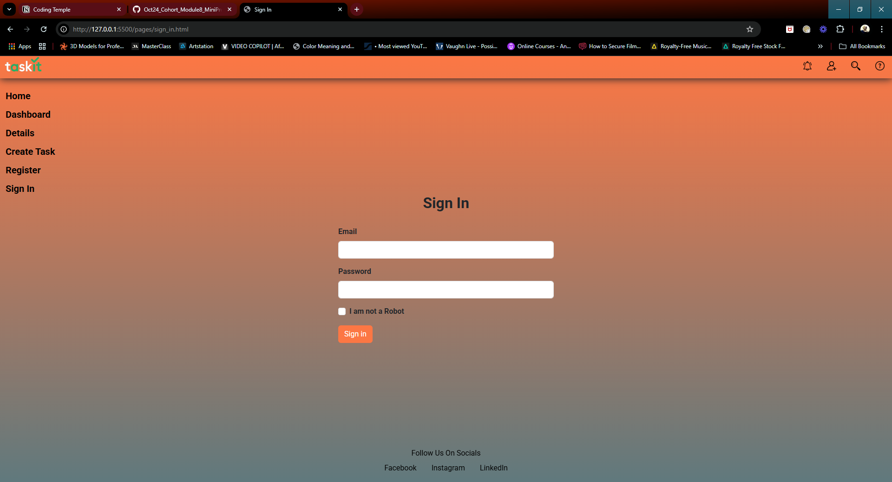
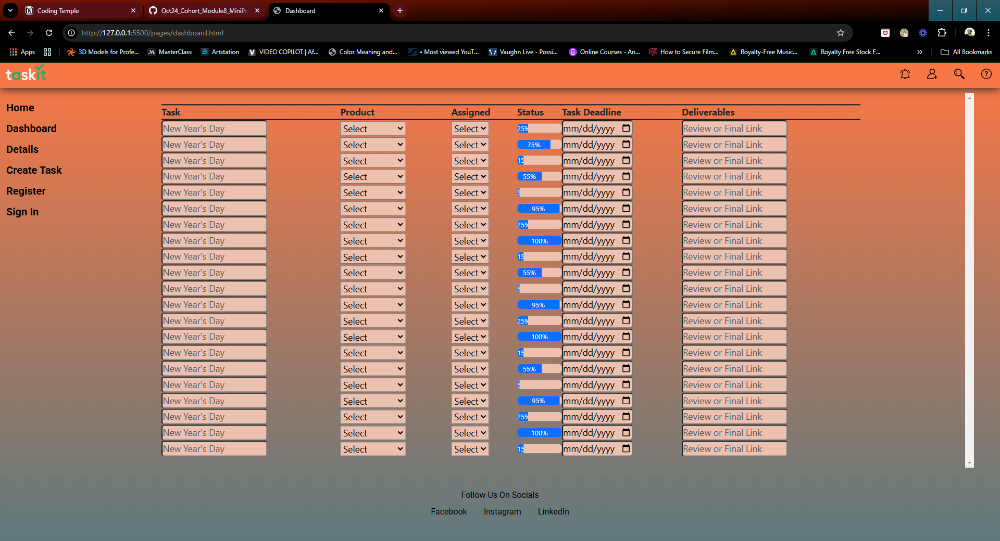
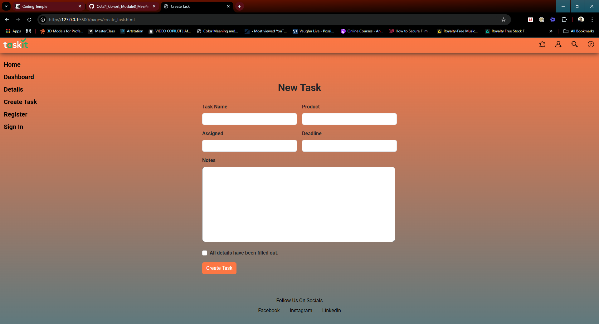
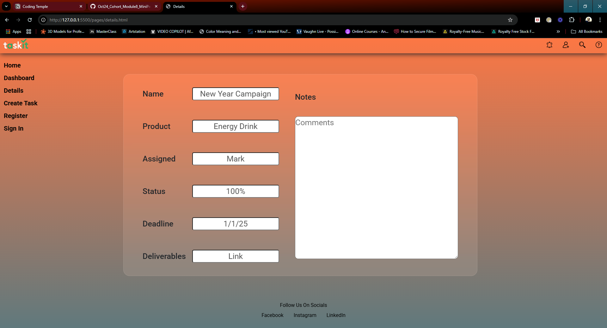
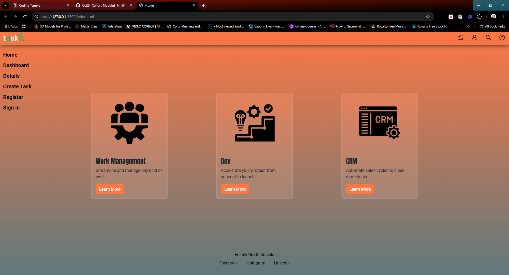
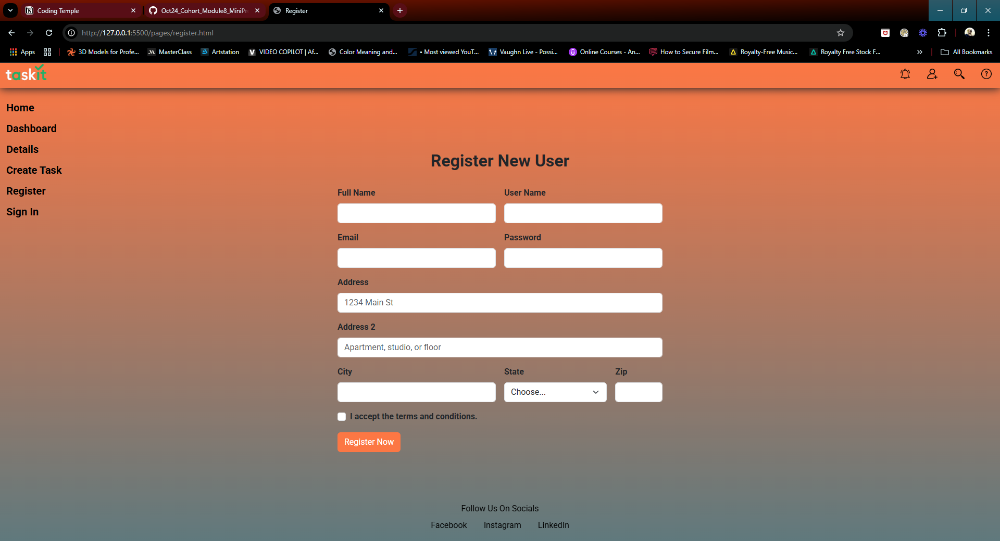

# Project Name: Task Management System

## Table of Contents
- [Project Name: Task Management System](#project-name-task-management-system)
  - [Table of Contents](#table-of-contents)
  - [Overview](#overview)
  - [Features](#features)
    - [Mockups Pages](#mockups-pages)
  - [Folder Structure](#folder-structure)
  - [Technologies Used](#technologies-used)

---

## Overview
This project is a simple **Task Management System** that allows users to create, view, and manage tasks. It features a user authentication system and a dashboard for task tracking.

---

## Features
- **User Authentication**: Register and sign in securely.
- **Task Management**: Create, view, and manage your tasks.
- **Responsive Design**: Optimized for various screen sizes.

---

### Mockups Pages
1. **Sign In Page**  
   

2. **Dashboard**  
   

3. **Create Task**  
   

4. **Details**  
   

5. **Home**  
   

6. **Register**  
   

---

## Folder Structure
```plaintext
.
├── images/
│   ├── mockup_screenshots/
├── pages/
│   ├── create_task.html
│   ├── dashboard.html
│   ├── details.html
│   ├── register.html
│   ├── sign_in.html
├── styles/
│   ├── create_task.css
│   ├── dashboard.css
│   ├── default.css
│   ├── details.css
│   ├── index.css
│   ├── register.css
│   ├── sign_in.css
├── index.html
```

## Technologies Used
- **HTML5**: for structure.
- **CSS3**: for styling.
- **Bootstrap**: for responsive design.